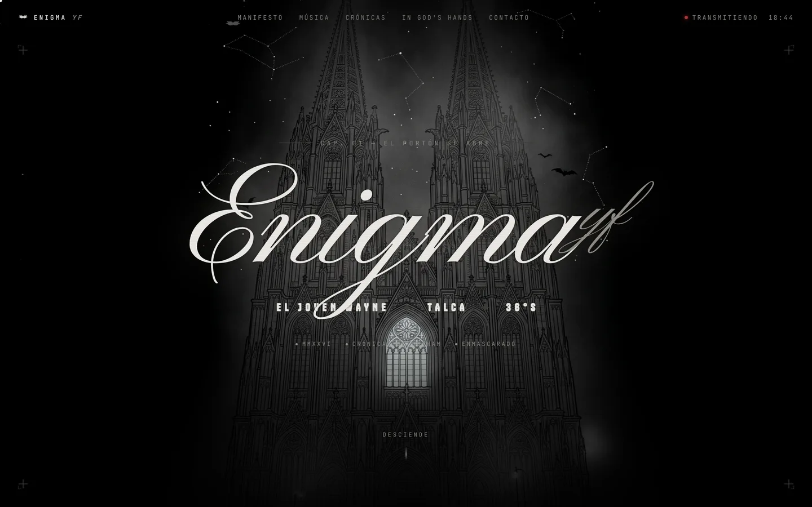

<p align="center">
  
</p>

<h1 align="center">ENIGMA yf · Crónicas de Gotham</h1>
<p align="center"><b>Mundo de artista · dirección gótica · by ShowUp</b></p>
<p align="center"><a href="https://enigma-yf.vercel.app"><b>🔗 enigma-yf.vercel.app</b></a></p>
<p align="center">
  
  
  
  
</p>

> Parallax, cursor personalizado, murciélagos animados y tracklist interactivo. Vanilla, sin build.

Sitio web oficial de **ENIGMA yf** — el joven Wayne. Talca, Chile · 36°S.
EP: *Pa Que Las Escuches en Spoti* — 05 cortes, prod. MOTTO, MMXXVI.

---

## Stack

Sitio estático vanilla — sin frameworks ni build steps.

| Archivo | Función |
|---------|---------|
| `index.html` | Estructura y markup |
| `styles.css` | Todo el estilo (custom properties, responsive) |
| `enigma.js` | Comportamiento: parallax, cursor, murciélagos, tracklist, nav móvil |
| `assets/` | Imágenes de producción |
| `vercel.json` | Headers de seguridad y caché para Vercel |

## Deploy

**Vercel** — conectar el repositorio y listo. No requiere build command ni output directory.

```
Framework: Other
Build Command: (vacío)
Output Directory: . (raíz)
```

## Desarrollo local

```bash
# Cualquier servidor estático sirve, por ejemplo:
npx serve .
# o
python -m http.server 8080
```

## Assets en producción

Solo la carpeta `assets/` va al repositorio.  
La carpeta `uploads/` (archivos crudos de referencia) está en `.gitignore`.

---

*todos los derechos en silencio*
